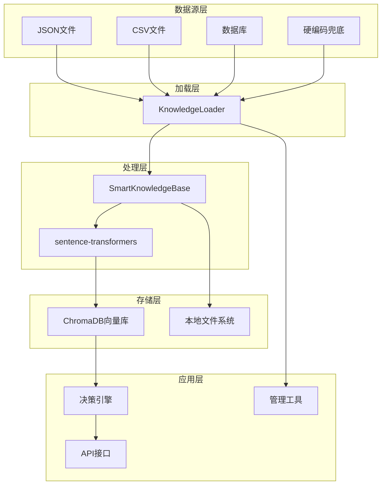

# 知识库管理指南

## 概述

CropPilot系统采用JSON文件 + 硬编码兜底的混合知识管理方案，结合ChromaDB向量数据库实现智能语义搜索。这种设计确保了系统的灵活性、可靠性和易用性。

## 系统架构

### 知识管理架构图



### 核心组件

1. **KnowledgeLoader**: 多数据源知识加载器
2. **SmartKnowledgeBase**: 智能知识库核心
3. **ChromaDB**: 向量数据库，支持语义搜索
4. **sentence-transformers**: 文本向量化模型

## JSON知识库格式

### 标准格式

```json
{
  "knowledge_base": {
    "version": "1.0",
    "last_updated": "2025-12-20T15:06:37.678316",
    "documents": [
      {
        "id": "unique_document_id",
        "content": "知识内容文本",
        "source": "知识来源",
        "crop": "适用作物",
        "stage": "生长阶段",
        "keywords": ["关键词1", "关键词2"],
        "priority": 1,
        "active": true
      }
    ]
  }
}
```

### 字段说明

| 字段 | 类型 | 必填 | 说明 |
|------|------|------|------|
| id | string | 是 | 文档唯一标识符 |
| content | string | 是 | 知识内容，用于向量化和搜索 |
| source | string | 是 | 知识来源，如"农业技术手册" |
| crop | string | 否 | 适用作物，默认"通用" |
| stage | string | 否 | 生长阶段，默认"通用" |
| keywords | array | 否 | 关键词列表，用于辅助搜索 |
| priority | integer | 否 | 优先级，数字越小优先级越高 |
| active | boolean | 否 | 是否启用，默认true |

## 管理工具使用

### 1. 交互式管理工具

```bash
python manage_knowledge.py
```

**功能菜单**：
- 查看所有知识
- 添加新知识
- 搜索知识
- 禁用/启用知识
- 退出

**使用示例**：
```
🌾 农业知识库管理工具
1. 查看所有知识
2. 添加新知识
3. 搜索知识
4. 禁用知识
5. 启用知识
0. 退出

请选择操作 (0-5): 2

📝 添加新知识:
知识内容: 小麦播种期要选择适宜的播种时间，一般在10月中下旬
知识来源: 小麦栽培技术规程
适用作物 (默认:通用): 小麦
生长阶段 (默认:通用): 播种期
关键词 (用逗号分隔): 小麦,播种,时间
优先级 (1-5, 默认:1): 1

✅ 成功添加知识条目: kb_20251220_150637
```

### 2. 演示脚本

```bash
python demo_knowledge_management.py
```

展示知识管理的完整流程，包括：
- 加载现有知识
- 添加新知识
- 重置向量数据库
- 测试新知识检索

### 3. 向量数据库重置

```bash
python reset_knowledge_db.py
```

**使用场景**：
- 更新JSON文件后
- 向量数据库损坏
- 需要重新构建索引

## 数据源配置

### 1. JSON文件数据源（推荐）

```python
from smart_knowledge import SmartKnowledgeBase

# 使用默认JSON文件
kb = SmartKnowledgeBase(data_source="json")

# 使用自定义JSON文件
kb = SmartKnowledgeBase(
    data_source="json", 
    data_path="data/custom_knowledge.json"
)
```

### 2. CSV文件数据源

```python
kb = SmartKnowledgeBase(
    data_source="csv", 
    data_path="data/knowledge.csv"
)
```

**CSV格式要求**：
```csv
id,content,source,crop,stage,keywords,priority,active
doc1,"知识内容","来源","作物","阶段","关键词1,关键词2",1,true
```

### 3. 数据库数据源

```python
# 需要传入数据库连接
kb = SmartKnowledgeBase(data_source="database")
```

### 4. 硬编码兜底

当其他数据源不可用时，系统自动使用硬编码的最小知识集合，确保系统始终可用。

## API集成

### 智能咨询接口

```python
# 直接调用
from smart_knowledge import smart_query

result = smart_query(
    question="水稻叶子发黄怎么办",
    crop_type="水稻",
    growth_stage="分蘖期"
)
```

### REST API调用

```bash
curl -X POST http://localhost:5000/api/smart_advice \
  -H "Content-Type: application/json" \
  -d '{
    "question": "水稻叶子发黄怎么办",
    "crop_type": "水稻", 
    "growth_stage": "分蘖期"
  }'
```

## 最佳实践

### 1. 知识内容编写

**好的知识内容**：
```json
{
  "content": "水稻分蘖期是水稻生长的关键时期，此时需要保持浅水层3-5cm，促进分蘖。施肥方面，每亩追施尿素5-8公斤，促进分蘖发生。注意防治稻飞虱和纹枯病。",
  "source": "水稻栽培技术手册",
  "crop": "水稻",
  "stage": "分蘖期"
}
```

**特点**：
- 内容具体详细
- 包含具体数值和操作指导
- 明确适用条件

### 2. 关键词设置

```json
{
  "keywords": ["分蘖", "浅水层", "尿素", "稻飞虱", "纹枯病"]
}
```

**原则**：
- 包含核心技术术语
- 涵盖问题和解决方案关键词
- 避免过于通用的词汇

### 3. 优先级设置

| 优先级 | 用途 | 示例 |
|--------|------|------|
| 1 | 核心技术知识 | 作物栽培技术要点 |
| 2 | 通用管理知识 | 病虫害防治原则 |
| 3 | 补充参考知识 | 相关背景信息 |

### 4. 版本管理

```json
{
  "knowledge_base": {
    "version": "1.1",
    "last_updated": "2025-12-20T15:06:37.678316",
    "changelog": [
      "v1.1: 添加小麦栽培知识",
      "v1.0: 初始版本"
    ]
  }
}
```

## 性能优化

### 1. 向量数据库优化

- **批量操作**: 批量添加文档提高效率
- **索引优化**: 定期重建索引保持性能
- **缓存机制**: 缓存常用查询结果

### 2. 查询优化

```python
# 优化查询参数
results = kb.query(
    question="叶子发黄",
    crop_type="水稻",
    growth_stage="分蘖期",
    n_results=3  # 限制结果数量
)
```

### 3. 内存管理

- 使用单例模式避免重复初始化
- 及时释放不用的模型资源
- 监控内存使用情况

## 故障排除

### 常见问题

**1. 向量数据库初始化失败**
```bash
# 解决方案：重置数据库
python reset_knowledge_db.py
```

**2. 模型下载失败**
```bash
# 解决方案：检查网络连接，重新安装
pip uninstall sentence-transformers
pip install sentence-transformers
```

**3. JSON文件格式错误**
```bash
# 解决方案：验证JSON格式
python -m json.tool data/agriculture_knowledge.json
```

**4. 搜索结果不准确**
- 检查关键词设置
- 调整相关性阈值
- 优化知识内容描述

### 日志分析

系统会输出详细的日志信息：
```
智能知识库初始化成功
从 agriculture_knowledge.json 加载了 11 条知识
成功初始化 11 条农业知识
```

## 扩展开发

### 1. 自定义数据源

```python
class CustomKnowledgeLoader(KnowledgeLoader):
    def load_from_api(self, api_url: str) -> List[Dict[str, Any]]:
        """从API加载知识"""
        # 实现API数据加载逻辑
        pass
```

### 2. 自定义向量模型

```python
# 使用不同的向量模型
kb = SmartKnowledgeBase()
kb.model = SentenceTransformer('paraphrase-multilingual-MiniLM-L12-v2')
```

### 3. 知识质量评估

```python
def evaluate_knowledge_quality(knowledge_docs):
    """评估知识质量"""
    for doc in knowledge_docs:
        # 检查内容长度
        # 验证关键词覆盖
        # 评估语义相关性
        pass
```

这个知识管理系统为CropPilot提供了灵活、可靠、易用的知识管理能力，支持系统的持续改进和扩展。