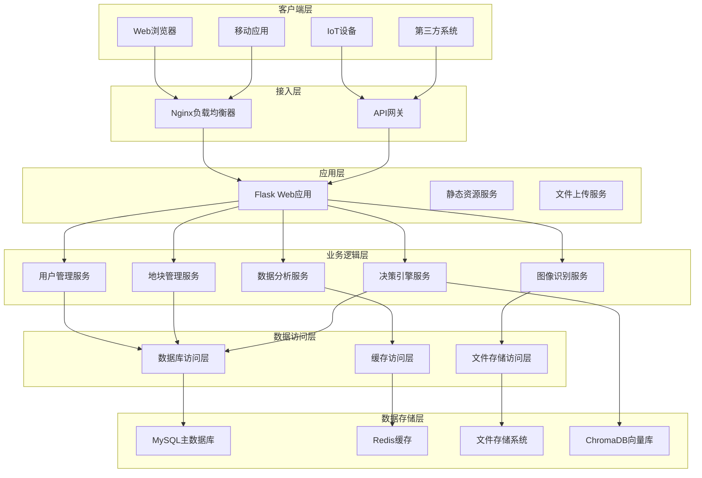
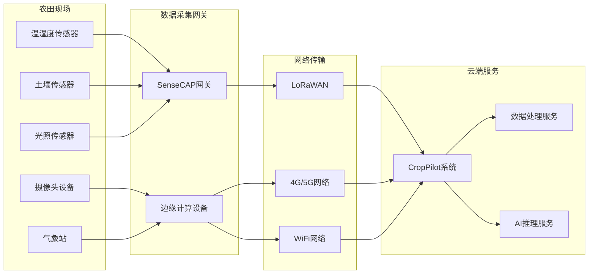
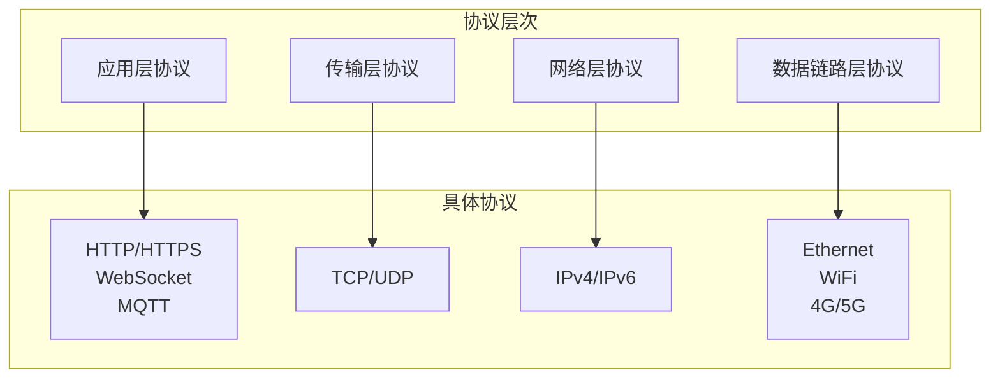
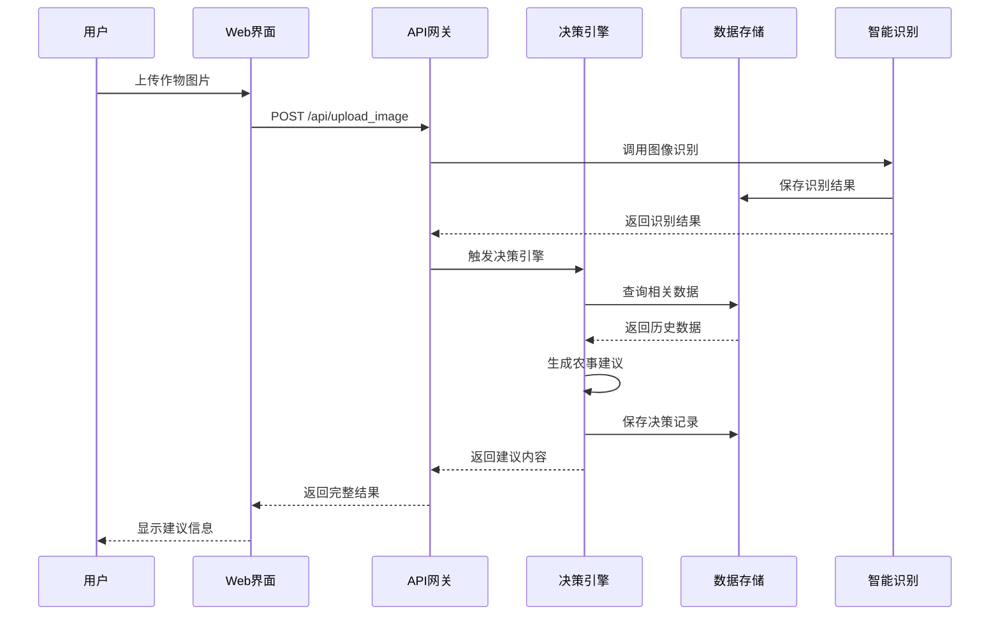
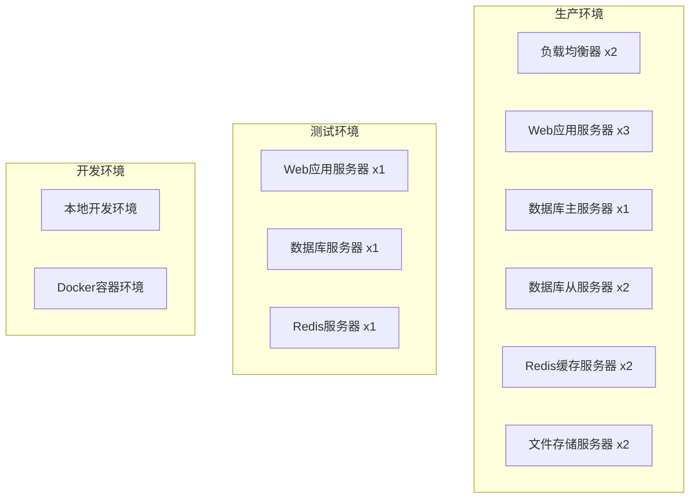
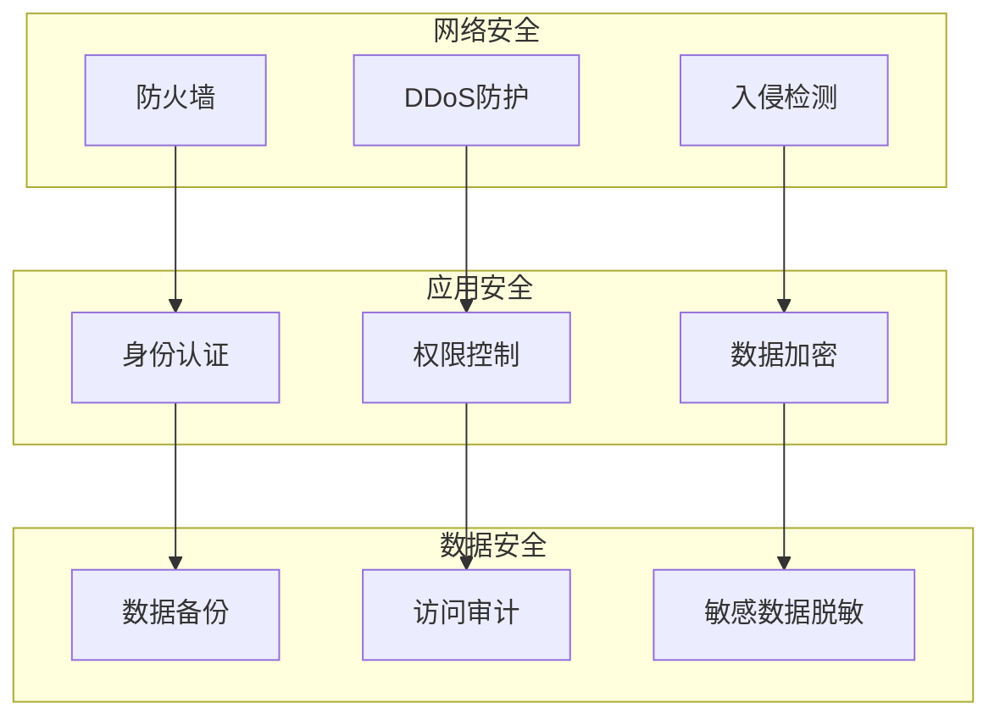

# CropPilot系统架构设计文档

## 1. 系统总体架构

### 1.1 架构概览

CropPilot系统采用分层架构模式，包含表示层、应用层、业务逻辑层、数据访问层和基础设施层。系统支持多种客户端接入，通过统一的API网关提供服务。



### 1.2 技术栈选择

| 层级 | 技术选择 | 说明 |
|------|----------|------|
| 前端 | HTML5 + CSS3 + JavaScript | 轻量级Web前端，兼容性好 |
| 后端框架 | Python Flask | 轻量级Web框架，开发效率高 |
| 数据库 | MySQL 8.0 | 成熟稳定的关系型数据库 |
| 缓存 | Redis | 高性能内存数据库 |
| 向量数据库 | ChromaDB | 专用于向量检索的数据库 |
| Web服务器 | Nginx | 高性能Web服务器和反向代理 |
| 应用服务器 | Gunicorn | Python WSGI HTTP服务器 |
| 容器化 | Docker | 应用容器化部署 |

## 2. 软硬件交互架构

### 2.1 硬件设备接入



### 2.2 数据流向设计

1. **传感器数据流**：传感器 → 网关 → 网络 → API接口 → 数据验证 → 数据库存储
2. **图像数据流**：摄像头 → 边缘设备 → 网络 → 文件上传 → 图像识别 → 结果存储
3. **决策数据流**：用户请求 → 决策引擎 → 规则匹配 → 知识检索 → 建议生成 → 结果返回

## 3. 网络通讯架构

### 3.1 通讯协议设计



### 3.2 API接口设计

| 接口类型 | 协议 | 用途 | 示例 |
|----------|------|------|------|
| RESTful API | HTTP/HTTPS | Web应用交互 | GET /api/fields |
| WebSocket | WS/WSS | 实时数据推送 | /ws/sensor-data |
| MQTT | MQTT over TCP | IoT设备通讯 | topic/sensor/data |
| File Upload | HTTP Multipart | 文件上传 | POST /api/upload |

### 3.3 安全通讯机制

1. **传输加密**：所有HTTP通讯使用HTTPS加密
2. **身份认证**：基于JWT Token的用户认证
3. **API鉴权**：基于角色的访问控制(RBAC)
4. **数据完整性**：请求签名验证机制

## 4. 功能模块架构

### 4.1 模块划分原则

- **高内聚低耦合**：模块内部功能紧密相关，模块间依赖最小化
- **单一职责**：每个模块只负责一个特定的业务领域
- **接口标准化**：模块间通过标准接口进行交互
- **可扩展性**：支持新模块的动态添加和现有模块的升级

### 4.2 核心模块设计

#### 4.2.1 数据采集模块

```python
class DataCollectionModule:
    """数据采集模块"""
    
    def __init__(self):
        self.sensor_collector = SensorDataCollector()
        self.image_processor = ImageProcessor()
        self.data_validator = DataValidator()
    
    def collect_sensor_data(self, device_id: str, data: dict) -> bool:
        """采集传感器数据"""
        pass
    
    def process_image_upload(self, image_file: bytes, metadata: dict) -> dict:
        """处理图像上传"""
        pass
    
    def validate_data_format(self, data: dict, schema: dict) -> bool:
        """验证数据格式"""
        pass
```

#### 4.2.2 数据存储模块

```python
class DataStorageModule:
    """数据存储模块"""
    
    def __init__(self):
        self.mysql_manager = MySQLManager()
        self.redis_manager = RedisManager()
        self.file_manager = FileStorageManager()
        self.vector_manager = VectorDBManager()
    
    def save_structured_data(self, table: str, data: dict) -> int:
        """保存结构化数据"""
        pass
    
    def cache_data(self, key: str, value: any, ttl: int) -> bool:
        """缓存数据"""
        pass
    
    def store_file(self, file_data: bytes, file_type: str) -> str:
        """存储文件"""
        pass
```

#### 4.2.3 决策引擎模块

```python
class DecisionEngineModule:
    """决策引擎模块"""
    
    def __init__(self):
        self.rule_engine = RuleEngine()
        self.stage_detector = GrowthStageDetector()
        self.anomaly_detector = AnomalyDetector()
        self.knowledge_retriever = KnowledgeRetriever()
    
    def generate_advice(self, field_id: int, context: dict) -> list:
        """生成农事建议"""
        pass
    
    def detect_growth_stage(self, crop_type: str, sensor_data: list) -> str:
        """检测生长阶段"""
        pass
    
    def detect_anomalies(self, sensor_data: list) -> list:
        """检测异常情况"""
        pass
```

#### 4.2.4 智能识别模块

```python
class IntelligentRecognitionModule:
    """智能识别模块"""
    
    def __init__(self):
        self.disease_classifier = DiseaseClassifier()
        self.semantic_searcher = SemanticSearcher()
        self.model_manager = ModelManager()
    
    def classify_disease(self, image_path: str) -> dict:
        """病虫害分类"""
        pass
    
    def semantic_search(self, query: str, context: dict) -> list:
        """语义搜索"""
        pass
    
    def load_model(self, model_name: str) -> object:
        """加载模型"""
        pass
```

#### 4.2.5 可视化展示模块

```python
class VisualizationModule:
    """可视化展示模块"""
    
    def __init__(self):
        self.chart_generator = ChartGenerator()
        self.report_generator = ReportGenerator()
        self.dashboard_manager = DashboardManager()
    
    def generate_trend_chart(self, data: list, chart_type: str) -> dict:
        """生成趋势图表"""
        pass
    
    def create_dashboard(self, user_id: int, config: dict) -> dict:
        """创建仪表板"""
        pass
    
    def export_report(self, field_id: int, format: str) -> bytes:
        """导出报告"""
        pass
```

### 4.3 模块间交互设计



## 5. 数据库架构设计

### 5.1 数据库选型

| 数据库类型 | 产品选择 | 用途 | 特点 |
|------------|----------|------|------|
| 关系型数据库 | MySQL 8.0 | 主要业务数据 | ACID特性，成熟稳定 |
| 内存数据库 | Redis 6.0 | 缓存和会话 | 高性能，支持多种数据结构 |
| 向量数据库 | ChromaDB | 知识检索 | 专用于向量相似度搜索 |
| 文件存储 | 本地文件系统 | 图片和文档 | 简单可靠，成本低 |

### 5.2 数据分片策略

1. **垂直分片**：按业务模块分离数据表
   - 用户相关表：users, user_settings
   - 地块相关表：fields, field_history
   - 传感器相关表：sensor_data, sensor_devices
   - 决策相关表：decision_records, knowledge_rules

2. **水平分片**：按时间或地理位置分片大数据表
   - sensor_data表按月份分片
   - decision_records表按年份分片

### 5.3 数据备份策略

1. **主从复制**：MySQL主从复制，读写分离
2. **定期备份**：每日全量备份，每小时增量备份
3. **异地备份**：重要数据异地存储
4. **恢复测试**：定期进行数据恢复演练

## 6. 部署架构设计

### 6.1 部署环境规划



### 6.2 容器化部署

```yaml
# docker-compose.yml
version: '3.8'
services:
  web:
    build: .
    ports:
      - "5000:5000"
    depends_on:
      - db
      - redis
    environment:
      - DB_HOST=db
      - REDIS_HOST=redis
  
  db:
    image: mysql:8.0
    environment:
      - MYSQL_ROOT_PASSWORD=password
      - MYSQL_DATABASE=crop_pilot_db
    volumes:
      - db_data:/var/lib/mysql
  
  redis:
    image: redis:6.0
    ports:
      - "6379:6379"
  
  nginx:
    image: nginx:alpine
    ports:
      - "80:80"
      - "443:443"
    depends_on:
      - web
```

### 6.3 监控和运维

1. **应用监控**：使用Prometheus + Grafana监控系统性能
2. **日志管理**：使用ELK Stack收集和分析日志
3. **健康检查**：定期检查服务状态和数据库连接
4. **自动扩容**：基于负载自动调整服务实例数量

## 7. 安全架构设计

### 7.1 安全防护体系



### 7.2 安全措施实施

1. **网络层安全**
   - 配置防火墙规则，只开放必要端口
   - 使用HTTPS加密所有Web通讯
   - 实施DDoS攻击防护

2. **应用层安全**
   - JWT Token身份认证
   - RBAC角色权限控制
   - SQL注入防护
   - XSS攻击防护

3. **数据层安全**
   - 数据库连接加密
   - 敏感数据字段加密存储
   - 定期安全漏洞扫描
   - 操作日志审计

## 8. 性能优化架构

### 8.1 缓存策略

1. **多级缓存**
   - 浏览器缓存：静态资源缓存
   - CDN缓存：图片和文件缓存
   - 应用缓存：热点数据缓存
   - 数据库缓存：查询结果缓存

2. **缓存更新策略**
   - 时间过期：设置合理的TTL
   - 主动更新：数据变更时主动清除缓存
   - 预热机制：系统启动时预加载热点数据

### 8.2 数据库优化

1. **索引优化**
   - 为常用查询字段创建索引
   - 复合索引优化多条件查询
   - 定期分析和优化慢查询

2. **查询优化**
   - 使用连接池减少连接开销
   - 分页查询避免大结果集
   - 读写分离提高并发能力

### 8.3 应用优化

1. **代码优化**
   - 异步处理耗时操作
   - 批量处理减少数据库访问
   - 合理使用多线程和协程

2. **资源优化**
   - 静态资源压缩和合并
   - 图片懒加载和压缩
   - 前端代码分块加载

这个系统架构设计为CropPilot提供了完整的技术框架，确保系统的可扩展性、可靠性和高性能。